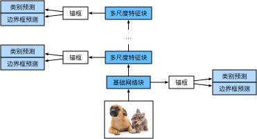

# SSD

Single Shot MultiBox Detector，多尺度目标检测模型，串联1\*基础网络块 + n\*多尺度特征块，单发多框检测生成不同尺寸锚框，预测边界框的类别和偏移量

**核心思想：**

1. 在不同尺度的特征图（feature maps）上放置先验框
    - 小特征图（低分辨率，感受野大） → 负责检测大目标
    - 大特征图（高分辨率，感受野小） → 负责检测小目标

2. 每个特征图位置，都有一组不同大小和长宽比的“候选框”，去覆盖可能的目标

    

3. 然后，SSD网络会：
    - 预测每个候选框里是不是有目标（分类）
    - 预测目标的精确边界（回归修正 anchor）

## 一种实现

类别预测层：每个像素生成a个框，类别有q+1个，使用**通道输出类别预测**防止全连接层参数过多，即保持高宽不变，$a(q+1)$个通道

多尺度预测的连结：每种尺度的输出flatten成**（批量大小，高\*宽\*通道数）**后在维度1上cat

高宽减半块：两个填充为1的3\*3卷积层 + 步幅为2的2\*2最大汇聚层，输出单元的感受野为6\*6

**网络结构：**基础网络 + 3*多尺度特征块 + 全局汇聚层，共5个模块

- 1，基础网络：3个减半块串联，通道数逐步翻倍
- 2～4，多尺度特征块：独立的减半块，通道恒为128
- 5，全局池化，高宽均降到1

损失函数：联合损失函数，交叉熵 + $L_1$损失

### 和YOLO对比

本质上均为**one-stage 检测器**，但侧重点不同

- **YOLO v1**：只有一个固定网格，每个格子预测少量边界框，对大目标效果好，但小目标容易漏掉
- **SSD**：用了多尺度网格（比如从 38×38 到 1×1 的多层特征图）每个位置预设多种大小和比例的anchor，不同层负责不同尺度目标，覆盖更全面

**相似点：**

- 都是 **端到端**，一次前向传播直接输出检测结果（分类+回归）
- 都是在 **网格/特征图** 上放 anchor 或者直接预测 box
- 都用**卷积特征**替代传统候选框搜索（不像 Faster R-CNN 先生成 proposals）

YOLOv2/v3 吸收 SSD 优点：

- YOLOv2 引入 **anchor boxes**（像 SSD 那样预设大小比例），解决了 YOLOv1 边界框僵硬的问题
- YOLOv3 引入 **FPN (Feature Pyramid Network)**，在多个尺度的特征图上预测目标（和 SSD 思路几乎一样）
- YOLOv5/7/8 甚至用 **PANet / BiFPN**，把特征金字塔做得更彻底

可以说，现代 YOLO = YOLO + SSD 的结合体

