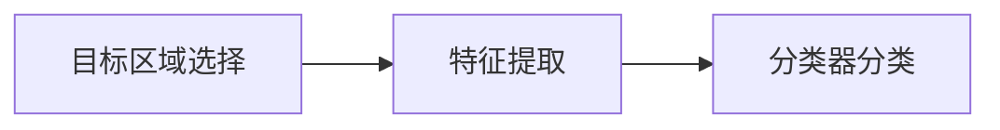
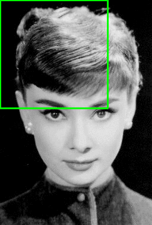

# 目标检测算法的历史发展脉络

从“机械设计”到“智能学习”，从“多步骤繁琐流程”到“端到端一体化”

CV三种任务：图像分类（单目标）、目标检测（多目标）、语义分割（像素级分类）

---

### 第一阶段：传统方法（OpenCV时代）

三阶段：

- **代表算法：Viola-Jones (2001), HOG + SVM (2005)**

- **核心思想**：

    - 目标区域选择：

        - **滑动窗口（Sliding Window）**：用不同大小、不同长宽比的窗口在图像上从左到右、从上到下滑动，穷举所有可能的位置

            

        - [**选择性搜索**](相关知识.md#选择性搜索)

    - **手工特征（Hand-crafted Features）**：用**人工设计的提取器**对每个窗口提取特征，参数少，提取质量不高
        - V-J 使用**Haar-like**特征
        - [HOG](相关知识.md#HOG)（Histogram of Oriented Gradients）：计算图像局部区域的**梯度方向直方图**

    - **分类器（Classifier）**：使用像 **AdaBoost**（V-J）或 **SVM**（HOG）这样的分类器来判断这个窗口里的特征是否属于一个特定物体（如人脸）

- **特点与局限**：计算效率低（因为要处理大量窗口），特征表达能力有限，难以应对复杂场景和多种物体；但因其简单可靠，在特定场景（如人脸检测）中至今仍有应用

------

### 第二阶段：深度学习萌芽与两阶段范式奠基

#### 1. [OverFeat (2013) - 承上启下者](OverFeat.md)

首次用CNN**统一**了分类、定位和检测任务，**在特征图上进行滑动窗口**

#### 2. [R-CNN (2014) - 开创者](R-CNN.md)

- **核心思想**：**Region Proposal + CNN**
    - **区域提议（Region Proposal）**：首先使用**选择性搜索（Selective Search）** 的算法“猜”出图像中可能包含物体的~2000个候选区域，这极大地减少了需要处理的窗口数量
    - **特征提取**：将每个候选区域**缩放到固定大小**，送入一个预训练好的CNN中提取特征
    - **分类与回归**：用SVM对特征进行分类，同时用一个线性回归模型对候选框的位置进行微调

- **奠基性贡献**：引入了**区域提议**的概念，避免了滑动窗口的穷举，证明了**CNN特征**在目标检测任务上的巨大优势，性能远超传统方法
- **巨大缺点**：**极慢**！每个区域都要单独通过CNN，计算冗余极大

#### 3. SPP-Net (2014) - 速度优化关键一步

**核心贡献**：**空间金字塔池化（Spatial Pyramid Pooling）**，允许网络**对任意大小的输入图像**生成固定长度的输出，**只需对整张图像做一次CNN特征提取**，然后通过SPP层为每个候选区域从共享的特征图上提取特征，解决了R-CNN中重复计算的问题，速度提升了数十倍

#### 4. Fast R-CNN (2015) - 整合与优化

- **核心改进**：继承了SPP-Net的**共享特征图**思想，提出了更简单的**RoI Pooling**层（SPP的简化版），**将分类器和边界框回归器整合进网络**，用Softmax代替SVM，**实现了端到端的训练**
- **意义**：大幅提升了速度和精度，是两阶段算法的一个非常成熟和高效的实现，**RoI Pooling及其后继者（如RoI Align）至今仍是重要组件**

#### 5. Faster R-CNN (2015) - 两阶段的终极形态

- **核心贡献**：**Region Proposal Network (RPN)**，**彻底抛弃了选择性搜索等传统方法**，引入了一个神经网络（RPN）来直接预测区域提议，RPN与检测网络（Fast R-CNN）共享特征图，几乎是在零代价的情况下生成候选区域
- **意义**：实现了**完全端到端**的深度学习检测流程，**奠定了现代两阶段检测算法的绝对基础**，**Faster R-CNN + RPN** 的结构成为了后续许多研究的起点，其思想影响深远

------

### 第三阶段：一阶段范式与实时检测的崛起

两阶段算法精度高，但**速度相对慢**

一阶段（One-Stage）算法**摒弃了区域提议步骤**，直接通过单次网络前向传播预测物体类别和位置，追求速度与精度的平衡

#### 1. [YOLO (2016) - 一阶段开创者](YOLOv1.md)

- **核心思想**：将图像划分为 `S x S` 的网格，每个网格负责预测中心点落在该网格内的物体，每个预测直接输出**边界框坐标、置信度和类别概率**
- **意义**：**实现了真正的实时检测**，速度极快，思维模式的转变：将检测视为一个**单一的回归问题**

#### 2. [SSD (2016) - 多尺度融合的经典](SSD.md)

- **核心贡献**：

    - **多尺度特征图（Multi-scale Feature Maps）**在不同尺度的特征图上进行预测，浅层特征图感受野小，利于检测小物体；深层特征图感受野大，利于检测大物体
    - 引入了**默认框（Default Boxes）** 的先验概念，类似于Faster R-CNN中的锚点框（Anchor）

- **意义**：在保持YOLO速度优势的同时，大幅提升了精度，尤其是小物体检测精度

    > 多尺度预测和Anchor机制已成为一阶段算法的标准配置

**YOLO 和 SSD 共同奠定了一阶段算法的基础，催生了至今仍在飞速发展的YOLO系列（v2, v3, ..., v11等）**

------

### 第四阶段：新时代的发展

#### 1. Anchor-Free 的回归

为了摆脱对Anchor设置的依赖，研究者提出了诸如：

- **CornerNet (2018) / CenterNet (2019)**：通过预测物体的**关键点**（如左上角、右下角、中心点）来定位物体，开创了Anchor-Free范式
- **FCOS (2019)**：对特征图上的每个像素点进行预测，直接回归距离边界框四边的距离

#### 2. Transformer的冲击

- **DETR (2020)**：首次将**Transformer**架构成功引入目标检测，完全摒弃了Anchor、NMS等手工设计组件，将检测视为一个**集合预测（Set Prediction）** 问题
- **意义**：提供了一种全新的、极其简洁的端到端检测范式，虽然训练慢，但思路非常新颖，引领了新一轮研究热潮

---

### 总结与脉络

| 时代             | 范式     | 代表算法                                                | 核心思想                             | 至今的影响                                  |
| :--------------- | :------- | :------------------------------------------------------ | :----------------------------------- | :------------------------------------------ |
| **传统**         | 滑动窗口 | Viola-Jones, HOG+SVM                                    | 手工特征 + 分类器                    | 特定领域应用，OpenCV基础                    |
| **深度学习萌芽** | 两阶段   | **R-CNN系列** (R-CNN -> Fast R-CNN -> **Faster R-CNN**) | **Region Proposal + CNN** -> **RPN** | **两阶段算法基石，RoI系列操作，Anchor机制** |
| **实时化需求**   | 一阶段   | **YOLO, SSD**                                           | 网格预测，**多尺度特征图+默认框**    | **一阶段算法基础，YOLO系列至今主导工业界**  |
| **新时代探索**   | 新范式   | **CornerNet/CenterNet, DETR**                           | **Anchor-Free, Transformer集合预测** | 提供新思路，影响学术研究方向                |

**至今仍发挥重要作用的奠基性算法：**

1. **Faster R-CNN**：两阶段算法的**绝对奠基者**，其**RPN**和**共享特征图**的思想是无数论文的对比基线和技术来源
2. **YOLOv3 / SSD**：一阶段算法的**经典架构**。尤其是YOLO系列，因其速度和精度的完美平衡，**至今仍是工业界应用最广泛、最受欢迎的检测算法家族**
3. **Anchor机制**：虽然Anchor-Free在发展，但源自Faster R-CNN和SSD的Anchor思想仍是许多主流算法的核心组成部分
4. **Backbone网络**：从R-CNN使用的AlexNet，到后来成为标准的**VGG、ResNet**，这些分类网络作为特征提取器（Backbone）的设计，是整个目标检测领域性能提升的基础

## YOLO

You Only Look Once，目标检测模型

| 版本       | 发布年份 | 作者/团队             | 核心改进                                                     | 特点                                                         | 论文                                                         |
| ---------- | -------- | --------------------- | ------------------------------------------------------------ | ------------------------------------------------------------ | ------------------------------------------------------------ |
| **YOLOv1** | 2016     | Joseph Redmon         | 将目标检测变为单个 CNN 回归问题（将图像分成网格，每个网格预测边界框和类别），一步完成预测 | 快，但精度低，不适合小物体                                   | 《You Only Look Once: Unified, Real-Time Object Detection》  |
| **YOLOv2** | 2017     | Redmon                | 引入 Anchor Boxes、BatchNorm、使用更深的特征网络（Darknet-19）、支持多类别 | 性能高于v1                                                   | 《YOLO9000: Better, Faster, Stronger》                       |
| **YOLOv3** | 2018     | Redmon                | 使用 ResNet风格的Darknet-53、支持多尺度预测（FPN）、使用logistic回归处理多标签分类 | 性能大幅提升，经典，使用广泛                                 | 《YOLOv3: An Incremental Improvement》                       |
| **YOLOv4** | 2020     | Alexey Bochkovskiy    | 集成多种工程技巧优化（数据增强：Mosaic、DropBlock，激活函数：Mish，使用CSPDarknet53、CIoU损失），精度和速度进一步提升 | 效果全面超越 YOLOv3                                          | 《YOLOv4: Optimal Speed and Accuracy of Object Detection》   |
| **YOLOv5** | 2020     | Ultralytics（非官方） | 模型分为 nano、small、medium、large 等级，用 Python 工程化封装良好，支持训练、测试、推理、部署一条龙 | 用 PyTorch 重写，工程化能力强，提供小中大等多种模型，工业界极其流行 | 无正式论文，由 Ultralytics 发布                              |
| **YOLOv6** | 2022     | 美团（Meituan）       | 更小模型结构、更快推理速度、优化 NMS、训练策略               | 工业级优化，适合边缘设备、手机端等部署                       | [https://github.com/meituan/YOLOv6](https://github.com/meituan/YOLOv6) |
| **YOLOv7** | 2022     | Wang et al.           | 强调速度和精度的平衡，引入 E-ELAN模块、模块融入RepConv、动态标签分配 | 精度和速度都优于 YOLOv6、YOLOv5                              | 《YOLOv7: Trainable bag-of-freebies sets new state-of-the-art for real-time object detectors》 |
| **YOLOv8** | 2023     | Ultralytics（官方）   | 完全重构的框架，支持分类、检测、分割，多任务统一，支持ONNX/TensorRT部署 | 不再兼容 YOLOv5 的结构，用法简洁，代码开箱即用               |                                                              |

